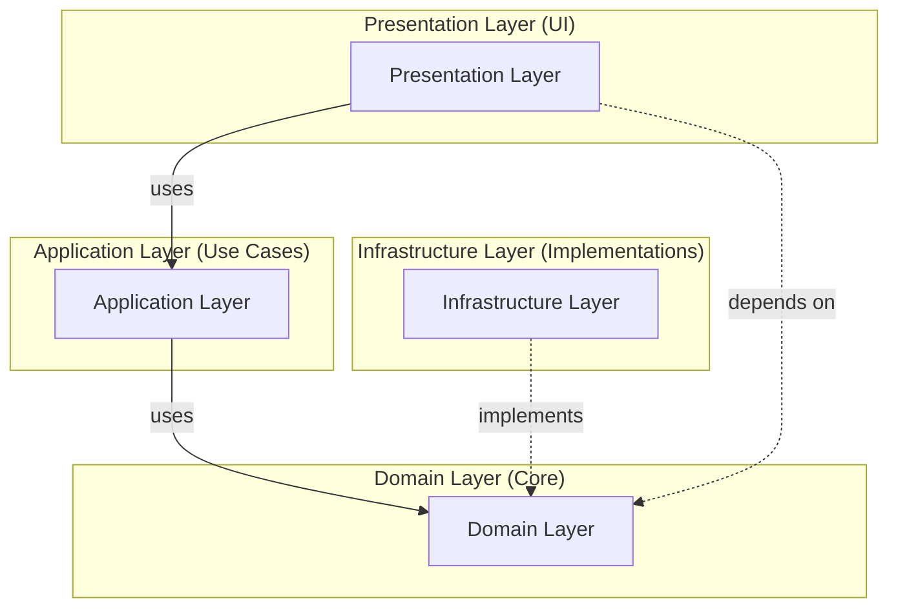

# 📊 Clean Architecture - Structure Créée

## ✅ Résumé de la Structure

**Date de création** : 2025-11-21  
**Status** : Structure complète créée à 100% ✅

---

## 📁 Statistiques

### Nombre de dossiers créés par couche

- **Domain Layer** : 34 dossiers

  - Contact (5), Quote (5), Lead Scoring (5), Admin (5), Auth (5), Shared (4)
  - Sous-dossiers : entities, value-objects, services, repositories, events, errors, types, interfaces

- **Application Layer** : 31 dossiers

  - Contact (5), Quote (5), Lead Scoring (5), Admin (5), Auth (5), Shared (3)
  - Sous-dossiers : commands, queries, dtos, mappers, validators, pagination, sorting, filtering

- **Infrastructure Layer** : 14 dossiers

  - Persistence (5 contextes)
  - External Services (5 services)
  - Cross-cutting (4 services)

- **Presentation Layer** : 14 dossiers

  - Components (5 contextes)
  - Hooks (5 contextes)
  - View Models (4 contextes)

- **Config Layer** : 2 dossiers
  - Dependencies, Environment

**TOTAL** : ~95 dossiers créés

---

## 🎯 Contextes (Bounded Contexts)

### 1. Contact

**Objectif** : Gérer les demandes de contact des utilisateurs

**Domain**

```
core/domain/contact/
├── entities/         → Contact, ContactRequest
├── value-objects/    → ContactType, MessageContent
├── services/         → ContactValidationService
├── repositories/     → IContactRepository
└── events/          → ContactSubmittedEvent
```

**Application**

```
core/application/contact/
├── commands/         → SubmitContactCommand, DeleteContactCommand
├── queries/          → GetContactQuery, ListContactsQuery
├── dtos/             → ContactDto, CreateContactDto
├── mappers/          → ContactMapper
└── validators/       → ContactValidator
```

### 2. Quote

**Objectif** : Gérer les devis et estimations de projets

**Domain**

```
core/domain/quote/
├── entities/         → Quote, QuoteItem, Service
├── value-objects/    → Money, ProjectType, Budget
├── services/         → PricingService, QuoteCalculator
├── repositories/     → IQuoteRepository
└── events/          → QuoteCreatedEvent, QuoteApprovedEvent
```

**Application**

```
core/application/quote/
├── commands/         → CreateQuoteCommand, UpdateQuoteCommand
├── queries/          → GetQuoteQuery, ListQuotesQuery
├── dtos/             → QuoteDto, QuoteItemDto
├── mappers/          → QuoteMapper
└── validators/       → QuoteValidator
```

### 3. Lead Scoring

**Objectif** : Scoring et enrichissement des leads

**Domain**

```
core/domain/lead-scoring/
├── entities/         → Lead, Score, ScoreHistory, Enrichment
├── value-objects/    → ScoreValue, Priority, Source
├── services/         → LeadScoringService, EnrichmentService
├── repositories/     → ILeadRepository, IScoreRepository
└── events/          → LeadScoredEvent, LeadEnrichedEvent
```

**Application**

```
core/application/lead-scoring/
├── commands/         → ScoreLeadCommand, EnrichLeadCommand
├── queries/          → GetLeadScoreQuery, GetLeadHistoryQuery
├── dtos/             → LeadScoreDto, EnrichmentDto
├── mappers/          → LeadMapper, ScoreMapper
└── validators/       → LeadValidator
```

### 4. Admin

**Objectif** : Administration et gestion des permissions

**Domain**

```
core/domain/admin/
├── entities/         → Admin, Permission, Role
├── value-objects/    → AdminLevel, AccessRight
├── services/         → AdminAuthService
├── repositories/     → IAdminRepository
└── events/          → AdminLoggedInEvent
```

### 5. Auth

**Objectif** : Authentification et gestion des sessions

**Domain**

```
core/domain/auth/
├── entities/         → User, Session, Token
├── value-objects/    → Password, SessionId, RefreshToken
├── services/         → AuthService, TokenService
├── repositories/     → IUserRepository, ISessionRepository
└── events/          → UserAuthenticatedEvent
```

### 6. Shared

**Objectif** : Éléments réutilisables cross-contexts

**Domain**

```
core/domain/shared/
├── value-objects/    → Email, PhoneNumber, Money, DateRange
├── errors/           → DomainError, ValidationError
├── types/            → Common types
└── interfaces/       → Common interfaces
```

---

## 🔌 Infrastructure Layer

### Persistence

```
infrastructure/persistence/
├── contact/          → ContactRepositoryImpl
├── quote/            → QuoteRepositoryImpl
├── lead-scoring/     → LeadRepositoryImpl, ScoreRepositoryImpl
├── admin/            → AdminRepositoryImpl
└── auth/             → UserRepositoryImpl, SessionRepositoryImpl
```

### External Services

```
infrastructure/external-services/
├── email/            → ResendEmailService, EmailTemplates
├── sms/              → SmsService
├── analytics/        → AnalyticsService
├── recaptcha/        → RecaptchaEnterpriseService
└── enrichment/       → HunterService, BrandfetchService
```

### Cross-cutting Concerns

```
infrastructure/
├── cache/            → RedisCacheService
├── rate-limiting/    → RedisRateLimiter
├── logging/          → Logger, SecurityLogger
└── monitoring/       → Monitoring, HealthChecks
```

---

## 🎨 Presentation Layer

### Components

```
presentation/components/
├── contact/          → ContactForm, ContactList, ContactCard
├── quote/            → QuoteForm, QuoteBuilder, QuotePreview
├── admin/            → AdminDashboard, AdminTable
├── auth/             → LoginForm, RegisterForm, PasswordReset
└── shared/           → Button, Input, Modal, Toast (Design System)
```

### Hooks

```
presentation/hooks/
├── contact/          → useSubmitContact, useContactList
├── quote/            → useCreateQuote, useQuoteList
├── admin/            → useAdminDashboard, useUserManagement
├── auth/             → useAuth, useLogin, useSession
└── shared/           → useDebounce, useLocalStorage, useApi
```

### View Models

```
presentation/view-models/
├── contact/          → ContactViewModel, ContactListViewModel
├── quote/            → QuoteViewModel, QuoteBuilderViewModel
├── admin/            → AdminDashboardViewModel
└── auth/             → LoginViewModel, ProfileViewModel
```

---

## ⚙️ Configuration

```
config/
├── dependencies/     → DI Container, ServiceRegistry
│   ├── container.ts
│   ├── contact.dependencies.ts
│   ├── quote.dependencies.ts
│   └── index.ts
└── environment/      → Environment variables, configuration
    ├── env.ts
    ├── config.ts
    └── index.ts
```

---

## 📋 Fichiers de Documentation Créés

1. **FOLDER_STRUCTURE.md** - Documentation complète de la structure
2. **STRUCTURE_SUMMARY.md** - Ce fichier (résumé)
3. **index.ts** - 25+ fichiers d'index créés dans tous les dossiers clés

---

## 🔄 Flux de Dépendances



**Règles strictes** :

- ✅ Domain ne dépend de RIEN (centre de l'architecture)
- ✅ Application dépend uniquement de Domain
- ✅ Infrastructure implémente les interfaces de Domain
- ✅ Presentation utilise Application et Domain
- ❌ Domain NE DOIT JAMAIS dépendre de Infrastructure ou Presentation

---

## 🎯 Prochaines Étapes

### Phase 4 : Implémentation Contact Context

- [ ] Créer les entities (Contact.ts)
- [ ] Créer les value objects (ContactType.ts, MessageContent.ts)
- [ ] Créer les repository interfaces (IContactRepository.ts)
- [ ] Créer les commandes (SubmitContactCommand.ts)
- [ ] Créer les handlers (SubmitContactHandler.ts)
- [ ] Créer les DTOs (ContactDto.ts)
- [ ] Créer les mappers (ContactMapper.ts)
- [ ] Créer l'implémentation repository (ContactRepositoryImpl.ts)
- [ ] Créer les hooks (useSubmitContact.ts)
- [ ] Créer les composants (ContactForm.tsx)
- [ ] Migrer les routes API
- [ ] Tests unitaires

### Phase 5 : Dupliquer pour les autres contextes

- [ ] Quote context (suivre le même pattern)
- [ ] Lead Scoring context
- [ ] Admin context
- [ ] Auth context

### Phase 6 : Configuration

- [ ] Configurer Dependency Injection Container
- [ ] Configurer TypeScript path aliases
- [ ] Environment configuration

### Phase 7 : Validation

- [ ] Build tests
- [ ] Tests unitaires
- [ ] Tests d'intégration
- [ ] Documentation finale

---

## ✅ Checklist de Création

- [x] Créer tous les dossiers Domain (34)
- [x] Créer tous les dossiers Application (31)
- [x] Créer tous les dossiers Infrastructure (14)
- [x] Créer tous les dossiers Presentation (14)
- [x] Créer dossiers Config (2)
- [x] Créer fichiers index.ts (25+)
- [x] Créer FOLDER_STRUCTURE.md
- [x] Créer STRUCTURE_SUMMARY.md
- [ ] Configurer TypeScript paths
- [ ] Créer DI Container
- [ ] Implémenter Contact context complet
- [ ] Migrer code existant

**Total Progress** : Structure 100% ✅ | Implémentation 0% ⏳

---

**Auteur** : Jean-Baptiste  
**Date** : 2025-11-21  
**Version** : 1.0.0
